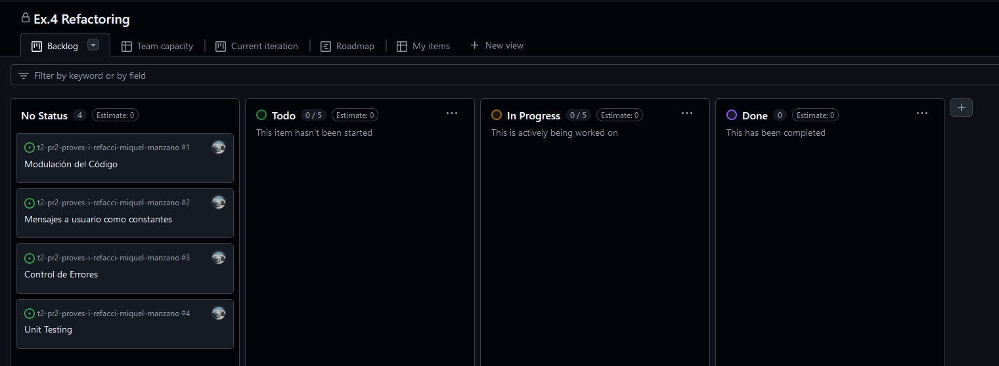
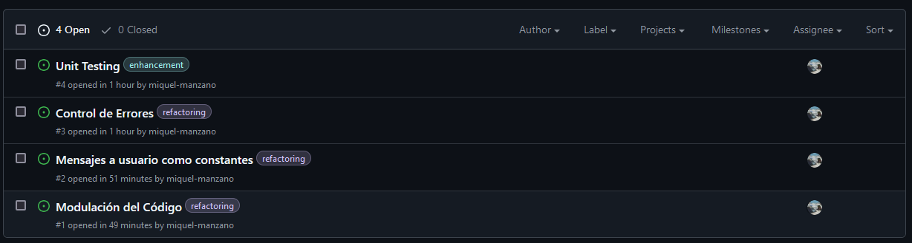
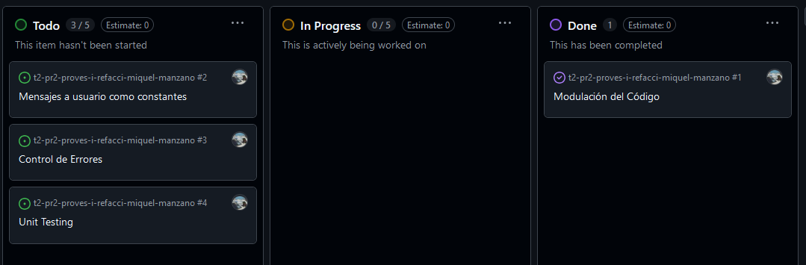
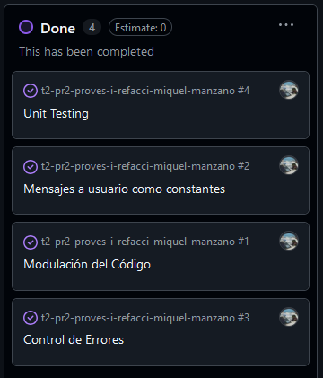
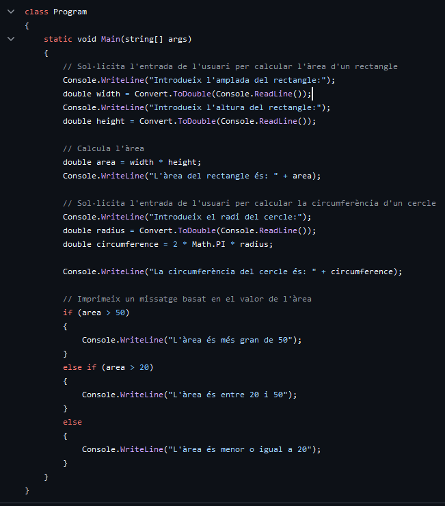
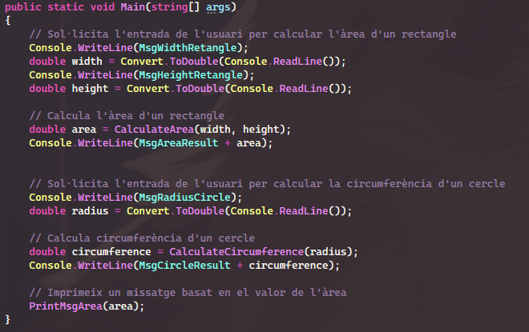
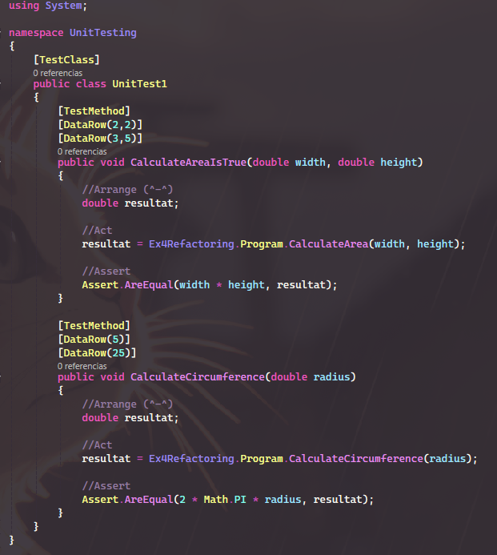

# Ex.4 Refactoring

Tasques d'aquest exercici:
- Crear un Projecte de GitHub al repositori.
- Crear issues per cada tasca de refactoritzacio, i conectarles al projecte.
- Tancar les issues/tasques desde el Visual Studio i les PR.
- Documentar els patrons aplicats als casos de proba.

## Captures GitHub - Project

### 1. Projecte i issues
Creacio del projecte i creacio de les issue adients a les tasques a seguir. A mes de conectarles al projecte.

### 2. Push, Pull Recuest and Merge
Exemple de issue amb push normal

Exemple de issue amb pull recuest mes merge

### 3. Resultat Final
Totes les issues resoltes

# Refactoring
Les modificacions que he fet alhora de refactoritzar el codi son:
- Modular el codi en funcions
- Fer us de constants en els missatges per consola
- Control d'Errors basic a l'hora de fer inputs

El Main abans:

El Main despres:

# Casos de Probes
Funcions on he aplicat els Unit Test

En aquest cas, com que no hem de comprobar rangs, no tenim casos extrems, aixi que he fet un Unit Test per cada funcio que verifiques que el resultat retornat fosi correcte:

miquel